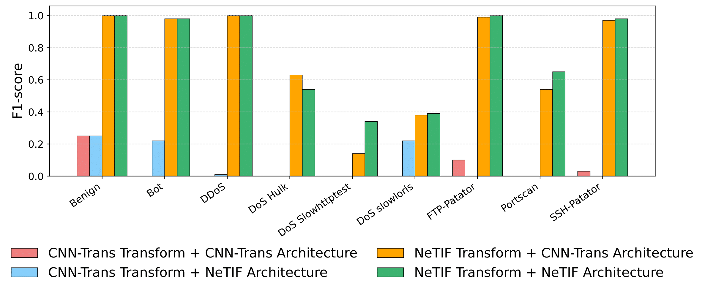
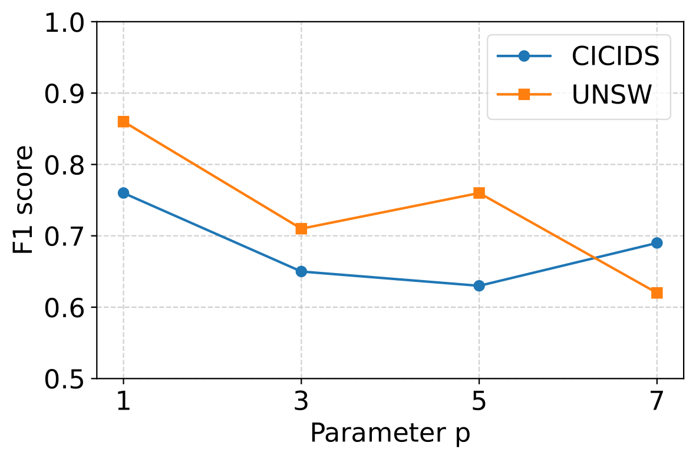
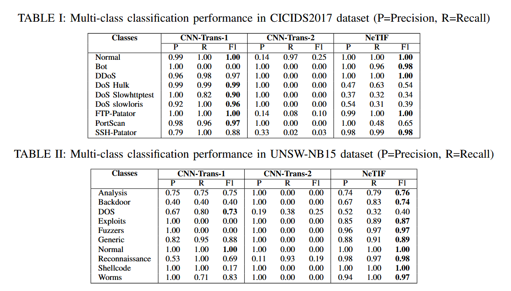

# NeTIF: Network Traffic to Image Features for Robust Intrusion Detection

This repository contains experimental results and visualizations from our paper:

> **NeTIF: Network Traffic to Image Features for Robust Intrusion Detection**  
> *Stephen Villanueva, Abu Saleh Md Tayeen, Qixu Gong, Satyajayant Misra, Aden Dogar, Huiping Cao, Jiefei Liu, Pratyay Kumar, Jayashree Harikumar*  
> New Mexico State University, University of Hartford, DEVCOM Analysis Center  
<!-- > *Presented at [Conference Name, Year]* -->

---

## Abstract

With the rapid increase in cyber attacks, Machine Learning (ML)-based Network Intrusion Detection Systems (NIDS) are essential for safeguarding computer network security. Most ML-based NIDS rely on either flow-based or packet-based network traffic feature representations. However, flow-based methods may overlook characteristics in individual packets and fail to detect certain attacks. Meanwhile, packet-based methods primarily capture the malicious payload of individual packets, often missing the abnormal correlations between multiple packets, rendering them ineffective against certain types of attacks. To overcome these limitations, we propose a Network Traffic to Image Features (NeTIF)-based Intrusion Detection System (IDS). NeTIF consists of two steps. The first step is a novel data transformation method that derives image representations of network flows from raw network packets. The second step is a Convolutional Neural Network (CNN) that automatically learns feature representations and patterns for detecting anomalous network flows. Our extensive experimental results on two public datasets demonstrate that our NeTIF-based IDS achieves a higher detection rate compared to traditional IDS approaches. Furthermore, our method’s superior performance can be easily explained through plotting intermediate features. This contributes to the model usability and interpretability, which is an increasingly critical aspect in cybersecurity applications.

---
 ## Methods

### 1. NeTIF
In order to replicate the experiments utilizing the NeTIF method, perform the following steps:
1) Acquire the required *.csv* and PCAP files for the relevant dataset. They can be found [here](https://research.unsw.edu.au/projects/unsw-nb15-dataset) for UNSW-NB15, and [here](https://www.unb.ca/cic/datasets/ids-2017.html) for CICIDS2017.
    * For UNSW-NB15, store these *.csv* files in the relative path *./UNSW_CSVs/* .
    * For CICIDS2017, store these *.csv* files in the relative path *./GeneratedLabelledFlows/TrafficLabelling/* .
2) Navigate to the *NeTIF* folder, and choose the folder of the relevant dataset.
3) Execute the notebook files in the listed step order. A brief description of each file's purpose is given here:
    * Step 1: Produces the preprocessed flow-based dataset for the given dataset.
    * Step 2: Generates the required *labelled_pcap_csv* files.
    * Step 3: Generates data using the NeTIF data transform.
    * Step 4: Trains and validates a CNN model on the data from step 3. 

### 2. CNN-Trans-1
In order to replicate the experiments utilizing the CNN-Trans-1 method, perform the following steps:
1) Acquire a the flow-based dataset for the relevant dataset.
2) Navigate to the *CNN-Trans-Baseline* folder, and choose the folder of the relevant dataset.
3) Execute the notebook files in the listed step order. A brief description of each file's purpose is given here:
    * Step 1: Performs various preprocessing steps on the flow data, as well as feature selection to derive the 20 most salient features.
    * Step 2: Performs additional preprocessing on the data.
        * For UNSW-NB15, SMOTE is implemented for data up-sampling.
    * Step 3: Generates the *224x224* training and testing images.
    * Step 4: Trains and validates an ensemble model, as well as it's five constituent models, on the data from step 3.  

### 3. CNN-Trans-2
In order to replicate the experiments utilizing the CNN-Trans-2 method, complete the steps listed above for CNN-Trans-1. After this, perform the following steps:
1) Execute the *get_CNN-Trans-2_data.ipynb* file. This will generate the testing data by using randomly selected flow sequences.
2) Execute the *test_on_CNN-Trans-2_data.ipynb* file. This will evaluate the trained model on the newly generated test data.

---
## Results

  
    
 
        
<b>Figure 1.</b> Visualization of CNN hidden units after 2nd layer for benign/malicious instances (1×1504 vectors stretched).

          
    
 

  
    
 
        
<b>Figure 2.</b> Count of flows containing certain numbers of packets

          
    
 
    
 
        
<b>Figure 3.</b> F1-scores for various transformation and classification combinations on CICIDS2017

          
    
 
    
 
        
<b>Figure 4.</b> F1-scores for various p on CICIDS2017 and UNSW

          
    

* #### Figure 1

Figure 4 visualizes the hidden units of intermediate CNN layers through class-wise heatmaps. The displayed heatmaps are for 1x1504 vectors, which are vertically stretched for easier visualization. These heatmaps illustrate how NeTIF spatially encodes distinctive attack signatures: DDoS traffic produces sharp, left-aligned hidden units indicative of repetitive header structures. DoS Hulk yields diffuse, irregular patterns reflecting randomized HTTP floods. SSH-Patator displays mid-range hidden-unit clusters associated with encrypted negotiation sequences, whereas FTP-Patator manifests narrow, left-aligned spikes corresponding to predictable plaintext login commands.

* #### Figure 2

In our experiments, to determine the value of p, *i.e.* the number of packets to select from each flow, we plotted histograms exhibiting the total number of flows containing a certain number of packets in Figure 3. In the x-axis of the figure, we show up to 15 packets per flow; in the y-axis we show the counts of flows. From Figure 3, we see that the majority of flows contain only a small number of packets, with 101,807 flows having a single packet in CICIDS2017 and 69,326 in UNSW-NB15, respectively. The number of flows drops sharply as the packet count increases, with very few flows exceeding 7 packets per flow. Notably, only 212 flows in UNSW-NB15 and 20,538 in CICIDS2017 have 15 or more packets, indicating a strong skew toward shorter flows. Since we aim to retrieve a fixed number of packets from each flow and most flows in both datasets contain only one packet, we set the default value of p to 1 in our experiments to ensure maximum data utilization and consistency across datasets. This choice allows us to retain most flows and avoid discarding valuable data due to flow length constraints. At the same time, we also evaluate the effect of the parameter p on the quality of the generated data for supporting anomaly detection, as discussed in Section IV-E4 of the paper. We partitioned each flow image collection into training and testing sets using 80% and 20% splitting.

* #### Figure 3

In Figure 3, we compare the F1-scores of different combinations of transformation and classification architectures for CICIDS2017. It shows that models using the NeTIF transformation, regardless of whether paired with the CNN-Trans or NeTIF architecture, consistently achieve near-perfect performance across all classes. In contrast, combinations using the CNN-Trans transformation result in significantly lower F1-scores, especially for classes like DoS Hulk, FTP-Patator, and SSH-Patator. This highlights the superior effectiveness of the NeTIF transformation in capturing discriminative features for both benign and malicious traffic.

* #### Figure 4

As Figure 6 shows, for CICIDS2017, performance remains constant at a perfect F1-score (∼ 1.0) across all values of p, suggesting that even minimal flow information is sufficient for effective classification. In contrast, the UNSW-NB15 dataset exhibits a decline in performance as p increases, where the highest F1-score achieved at p = 1. This indicates that reducing the number of usable flows and increasing the number of packets for aggregation in flows at higher p negatively affects model performance, likely due to decreased training diversity and sample size. These results align with the observed flow length distributions in both datasets. As detailed in Figure 2, most flows contain only a small number of packets—especially in the UNSW-NB15 dataset, where flows longer than 7 packets are exceedingly rare. As a result, using a smaller p value maximizes data retention and helps maintain model generalizability by leveraging a larger, more diverse training set.

## Model Evaluation

We compare the performance of NeTIF against baseline methods (flow-feature based IDS, CNN-Trans-1, and CNN-Trans-2) on multi-class intrusion detection problem using both datasets, with results detailed in Table I and Table II. We used the default setting for the data preprocessing, training, and testing as explained in Section IV-B of the paper.

 
      

---

